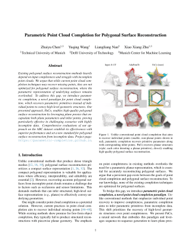

# PaCo: Parametric Point Cloud Completion

-----------
[](https://parametric-completion.github.io)
[](https://arxiv.org/abs/2503.08363) 

PaCo implements parametric completion, a new point cloud completion paradigm that recovers parametric primitives rather than individual points, for **polygonal surface reconstruction**.

<p align="center">
  
</p>

## 🤹‍♂️ Demo

Simply click the badge below to run the demo:

[](https://colab.research.google.com/github/parametric-completion/paco/blob/main/demo/demo.ipynb)

## 🛠️ Setup

### Prerequisites

Before you begin, ensure that your system has the following prerequisites installed:
* Conda
* CUDA Toolkit
* gcc & g++

The code has been tested with Python 3.10, PyTorch 2.6.0 and CUDA 11.8.

### Installation

1. **Clone the repository and enter the project directory:**
   
   ```bash
   git clone https://github.com/parametric-completion/paco && cd paco
   ```

3. **Install dependencies:**
   
   Create a conda environment with all required dependencies:
   ```bash
   . install.sh
   ```

## 🚀 Usage

### 🎯 Training

* Start training using one of the two parallelization:

   **Distributed Data Parallel (DDP):**
  
    ```bash
    # Replace device IDs with your own
    CUDA_VISIBLE_DEVICES=0,1 ./scripts/train_ddp.sh
    ```

   **Data Parallel (DP):**
  
    ```bash
    # Replace device IDs with your own
    CUDA_VISIBLE_DEVICES=0,1 ./scripts/train_dp.sh
    ```

* Monitor training progress using TensorBoard:
  
  ```bash
  # Replace ${exp_name} with your experiment name (e.g., default)
  # Board typically available at http://localhost:6006
  tensorboard --logdir './output/${exp_name}/tensorboard'
  ```

### 📊 Evaluation

* (Optional) Build the [PolyFit](https://github.com/LiangliangNan/PolyFit) solver:
  
   ```bash
   ./scripts/install_polyfit.sh
   ```

* (Optional) Download pretrained weights: [](https://1drv.ms/f/s!AseUjD457t0Sg-ZumbwMwsOliiwDRw?e=H7I5F4) to `./ckpt/ckpt-best.pth`.

* Start evaluation of the reconstruction:
  
   ```bash
   # Default checkpoint at `./ckpt/ckpt-best.pth`
   CUDA_VISIBLE_DEVICES=0,1 ./scripts/test.sh
   ```

   The results will be saved to `${output_dir}/evaluation.csv`.

### ⚙️ Available configurations

```bash
# Check available configurations for training
python train.py --cfg job

# Check available configurations for evaluation
python test.py --cfg job
```

Alternatively, review the main configuration file: `conf/config.yaml`.

## 🚧 TODOs

- [x] Demo and pretrained weights
- [ ] Dataset and evaluation script
- [ ] Hugging Face space

## 🎓 Citation

If you use PaCo in a scientific work, please consider citing the paper:

<a href="https://arxiv.org/pdf/2503.08363"></a>
<a href="https://arxiv.org/pdf/2503.08363">[paper]</a>&nbsp;&nbsp;<a href="https://arxiv.org/abs/2503.08363">[arxiv]</a><br>
```bibtex
@InProceedings{chen2025paco,
    title={Parametric Point Cloud Completion for Polygonal Surface Reconstruction}, 
    author={Zhaiyu Chen and Yuqing Wang and Liangliang Nan and Xiao Xiang Zhu},
    booktitle={Proceedings of the IEEE/CVF Conference on Computer Vision and Pattern Recognition (CVPR)},
    year={2025}
}
```
<br clear="left"/>

## 🙏 Acknowledgements

Part of our implementation is based on the [PoinTr](https://github.com/yuxumin/PoinTr) repository. We thank the authors for open-sourcing their great work.
